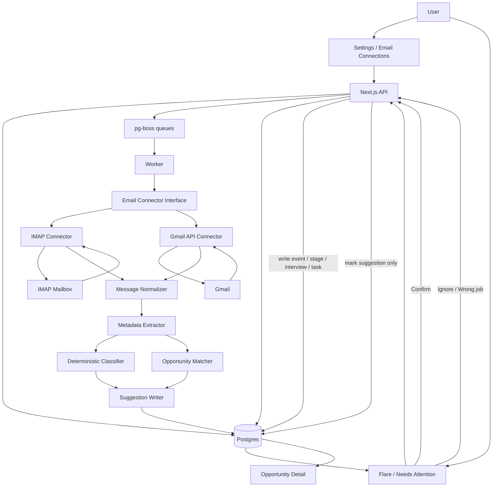

# Phase 7 technical plan: email metadata extraction and suggestions

## Goal

Phase 7 lets Path of Pain connect to a user's email, inspect new job-search messages, extract deterministic metadata, and create confirmable suggestions in Flare.

The product rule is simple: **email can propose history, but only the user can write history.**

## Product principles

- No LLM is required or used for Phase 7.
- No full email body is stored in Postgres.
- No maintainer-operated inbox, proxy, telemetry, or cloud classifier.
- Suggestions must be explainable: every assertion has evidence and match reasons.
- High confidence can feel surprising in the UI, but it is still only a proposal.
- Confirming a suggestion writes the timeline event. Ignoring it leaves the opportunity untouched.

## Full System Diagram



## Data Retention Model

The worker may read full message content in memory during sync. It must not persist the full body, HTML, attachments, or raw MIME.

Stored data should be enough to explain and dedupe suggestions:

- provider and provider message id
- sender email and sender domain
- normalized subject, or subject hash if privacy mode requires it
- received timestamp
- selected links/domains, capped and filtered
- deterministic assertion type and confidence
- evidence labels, not body dumps
- optional tiny quote/snippet, disabled by default and capped if enabled
- matched opportunity id and match reasons
- suggestion status

## Tables

### `email_connection`

Purpose: stores the user's configured mailbox connection.

Fields:

- `id`
- `user_id`
- `provider`: `imap` | `gmail`
- `label`
- `encrypted_config`
- `status`: `active` | `paused` | `error`
- `last_sync_at`
- `last_error`
- `sync_window_days`
- `store_subject`: boolean, default `true`
- `store_snippets`: boolean, default `false`
- `created_at`
- `updated_at`

Notes:

- `encrypted_config` contains IMAP host/port/TLS/user/password or Gmail OAuth tokens.
- Credentials are encrypted with instance `ENCRYPTION_KEY`.
- Disconnect deletes encrypted credentials and pauses future sync.

### `email_message_ref`

Purpose: minimal message identity and dedupe record.

Fields:

- `id`
- `user_id`
- `connection_id`
- `provider`
- `provider_message_id`
- `thread_id`
- `from_email`
- `from_domain`
- `subject`
- `subject_hash`
- `received_at`
- `processed_at`
- `metadata`: JSON, capped
- `created_at`

Indexes:

- unique on `user_id`, `provider`, `provider_message_id`
- index on `user_id`, `received_at`
- index on `user_id`, `from_domain`

### `email_suggestion`

Purpose: user-confirmable assertion.

Fields:

- `id`
- `user_id`
- `message_ref_id`
- `opportunity_id`
- `type`: `application_received` | `assessment` | `interview_request` | `rejection` | `offer` | `follow_up`
- `confidence`: integer 0-100
- `status`: `pending` | `confirmed` | `ignored` | `wrong_job`
- `summary`
- `evidence`: JSON array of labels and matched rule ids
- `match_reasons`: JSON array
- `proposed_event`: JSON
- `created_at`
- `resolved_at`

Notes:

- `proposed_event` is the payload to write if confirmed.
- Confirming a suggestion creates an immutable `opportunity_event`.
- Interview suggestions may also create an `interview`; assessment suggestions may create a task.

## Package Structure

Build Phase 7 mostly in `packages/email`, then wire it through db/API/worker.

```txt
packages/email/src/
  index.ts
  crypto.ts
  types.ts
  connectors/
    interface.ts
    imap.ts
    gmail.ts
  normalize/
    message.ts
    text.ts
    links.ts
  extract/
    metadata.ts
    dates.ts
  classify/
    rules.ts
    classifier.ts
    fixtures/
  match/
    opportunity.ts
    scoring.ts
```

## Pipeline

1. User connects email in Settings.
2. API validates settings, encrypts credentials, stores `email_connection`.
3. API enqueues `sync-email-connection`.
4. Worker fetches only messages inside the configured sync window.
5. Connector emits normalized messages one at a time.
6. Normalizer converts MIME/HTML to temporary plain text in memory.
7. Metadata extractor derives:
   - sender/domain
   - subject tokens
   - body tokens
   - safe links/domains
   - possible dates/times
   - company/title candidates
8. Deterministic classifier scores candidate assertion types.
9. Matcher scores possible opportunities.
10. Suggestion writer stores only message ref + assertion packet.
11. Flare displays pending suggestions.
12. User confirms, ignores, or marks wrong job.

## Deterministic NLP Approach

This should be plain TypeScript rules first. We can add lightweight NLP packages later if they earn their keep.

Useful deterministic techniques:

- Unicode normalization and lowercasing
- HTML-to-text conversion
- sentence splitting
- tokenization
- stop-word removal
- phrase dictionaries
- negation windows
- sender-domain matching
- company/title token overlap
- URL/domain extraction
- date parsing for interviews

Potential packages:

- `chrono-node` for deterministic date extraction
- `html-to-text` or existing parser utilities for body normalization
- `natural`, `wink-nlp`, or `compromise` only if custom tokenization becomes brittle

Initial recommendation: start custom and small; add `chrono-node` only when implementing interview scheduling.

## Assertion Types And Rules

Each classifier result should include:

- `type`
- `score`
- `confidence`
- `ruleIds`
- `evidenceLabels`
- `blockingReasons`

### Rejection

Strong cues:

- "will not be moving forward"
- "not moving forward with your application"
- "decided to proceed with other candidates"
- "unable to offer you"
- "not selected"

Weak cues:

- "unfortunately"
- "after careful consideration"
- "competitive applicant pool"

Guards:

- Do not classify as rejection from subject alone.
- Require at least one strong cue or multiple medium cues from body text.
- Block or lower confidence if near "not a rejection", "not final", "not yet", "cannot reject".

### Interview Request

Strong cues:

- scheduling links
- "schedule an interview"
- "next interview"
- "meet with"
- "availability"
- date/time plus interview vocabulary

Outputs:

- proposed `INTERVIEW_REQUESTED` event
- optional proposed interview record if a date/time is confidently parsed

### Assessment / OA

Strong cues:

- "assessment"
- "online assessment"
- "coding challenge"
- "take-home"
- "HackerRank"
- "CodeSignal"
- "Codility"

Outputs:

- proposed `ASSESSMENT_REQUESTED` event
- optional task: "Complete assessment"

### Application Received

Strong cues:

- "received your application"
- "thank you for applying"
- "application has been submitted"

Guards:

- Lower confidence if also contains rejection/interview/assessment cues.

### Offer

Strong cues:

- "offer letter"
- "pleased to offer"
- "extend an offer"
- compensation or start-date language near offer phrase

Guards:

- Do not classify recruiting marketing as an offer.
- Require body cue, not subject alone.

## Opportunity Matching

Scoring should be deterministic and explainable.

Signals:

- sender domain equals company domain
- sender domain appears in company website/source URL
- email mentions company name
- email mentions normalized title tokens
- email contains ATS domain and job id already known
- thread id has previously been linked to an opportunity

Suggested thresholds:

- `80+`: high confidence, show as a strong Flare item
- `55-79`: medium confidence, show with caution
- `35-54`: low confidence, inbox-only suggestion
- `<35`: do not create suggestion unless classifier is very strong and no opportunity match is needed

Tie behavior:

- If two opportunities are within 10 points, do not auto-pick.
- Store suggestion with candidate matches and ask the user to choose.

## Flare UX

Flare should feel like opening a clue, not approving a spreadsheet row.

List language:

- "Something moved in the inbox."
- "A recruiter signal surfaced."
- "One possible turn in the trail."
- "The ledger found a new omen."

Suggestion card:

- compact mystery state before expansion
- company/job pill
- assertion type
- confidence label
- received time
- evidence chips
- match reasons
- Confirm
- Ignore
- Wrong job

Confirm copy:

- Rejection: "Write it to the ledger"
- Interview: "Add interview"
- Assessment: "Add ordeal"
- Application received: "Mark received"
- Offer: "Record offer"

The fun is in the reveal; the safety is in the confirm button.

## API Surface

Add:

- `GET /api/email/connections`
- `POST /api/email/connections`
- `POST /api/email/connections/:id/sync`
- `POST /api/email/connections/:id/disconnect`
- `DELETE /api/email/connections/:id/metadata`
- `GET /api/email/suggestions`
- `POST /api/email/suggestions/:id/confirm`
- `POST /api/email/suggestions/:id/ignore`
- `POST /api/email/suggestions/:id/wrong-job`

Confirm endpoint behavior:

1. Verify user owns suggestion and opportunity.
2. Verify suggestion is still pending.
3. In a transaction:
   - write `opportunity_event`
   - create interview/task if applicable
   - mark suggestion confirmed
   - update `last_activity_at`

## Queue Jobs

Add queues:

- `sync-email-connection`
- `classify-email-message` only if classification needs to be split from sync later

Start with one sync job for simplicity. Split only if mailbox sync gets slow.

## Privacy And Security

- Encrypt connection secrets at rest with `ENCRYPTION_KEY`.
- Never log credentials, tokens, message bodies, snippets, or raw headers.
- Limit sync window, default 30 days.
- Cap message body bytes read into memory.
- Skip attachments entirely.
- Store body snippets only if explicitly enabled.
- Provide disconnect and delete-metadata actions.
- Make sync manual first, scheduled later.
- Rate-limit sync endpoints.
- Gmail API requires user-owned OAuth setup; no project-operated OAuth app.

## Testing Plan

Unit tests:

- encryption roundtrip and wrong-key failure
- message normalization strips HTML safely
- deterministic classifier fixtures for each assertion type
- negation guards
- opportunity matcher scoring
- tie behavior
- no full body stored in suggestion/ref payloads

Integration tests:

- create connection with encrypted config
- sync fixture mailbox into suggestions
- confirm suggestion writes event
- ignore suggestion does not touch opportunity
- disconnect removes credentials
- delete metadata clears refs/suggestions without deleting opportunity history

E2E:

- Flare displays pending email suggestion
- user expands the clue card
- confirm writes timeline event
- 375px and 390px layouts have no horizontal scroll

## Rollout Slices

### Slice 1: deterministic engine with fixtures

- No real mailbox yet.
- Build normalizer, extractor, classifier, matcher.
- Use fixture emails and existing opportunities.
- Prove no full body gets stored.

### Slice 2: DB and Flare suggestions

- Add tables and queries.
- Add pending suggestions into `/api/dashboard`.
- Build Flare UI for confirm/ignore/wrong job.
- Add confirm transaction.

### Slice 3: IMAP connection and manual sync

- Settings form for IMAP.
- Encrypt credentials.
- Worker sync job.
- Manual "sync now" button.

### Slice 4: Gmail API connector

- User-owned OAuth configuration.
- Token refresh.
- Same connector interface.
- Same extractor/classifier/matcher pipeline.

### Slice 5: polish and scheduling

- Optional scheduled sync.
- Better interview date extraction.
- Snippet opt-in.
- More locale-aware rule packs.

## Open Questions

- Should subject text be stored by default, or should privacy mode default to subject hash only?
- Should snippets be entirely disabled in v1, or opt-in with a strict character cap?
- Do we want "manual sync only" for the first self-hosted release?
- Should Gmail API wait until after IMAP proves the suggestion UX?
- How theatrical should Flare be before it risks feeling distracting?

## Done Criteria

Phase 7 is done when:

- a user can connect IMAP or Gmail using their own instance configuration
- sync creates deterministic suggestions without storing full email bodies
- Flare presents the suggestion with evidence and a sense of reveal
- Confirm writes an immutable event against the correct opportunity
- Ignore/wrong-job never changes opportunity history
- disconnect and delete metadata work
- tests cover classifiers, matching, privacy constraints, and mobile Flare UX
